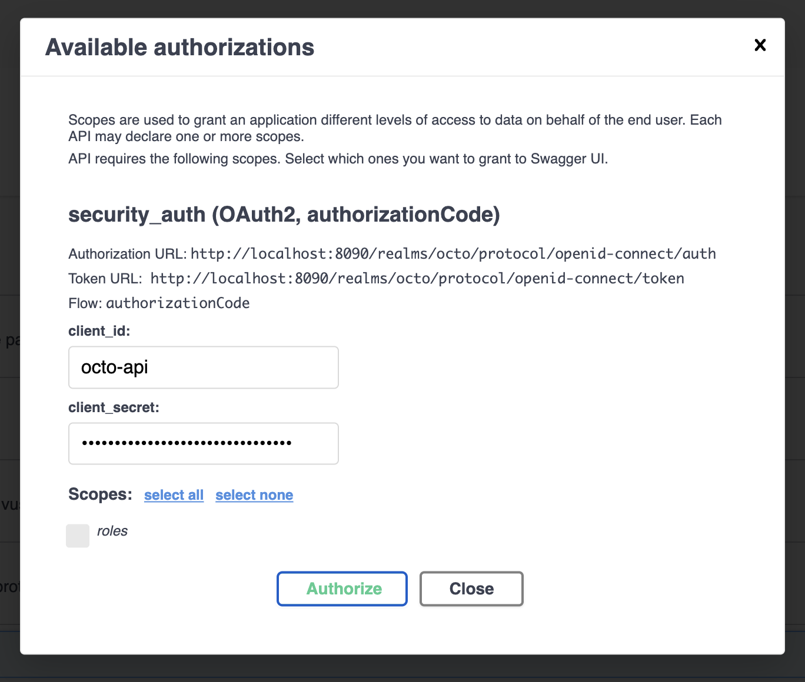
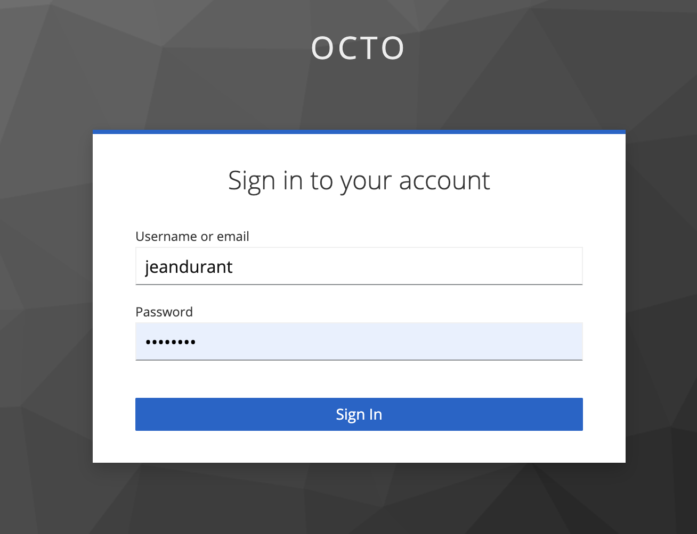

# ☕ AJAVA

> Ce repository contient le code source du TP sur le développement d'API en JAVA/Spring.

## 💻 Installation

Vous devez avoir sur votre poste :

* JAVA en version 17
* DOCKER (et docker-compose)

## 🚀 Démarrage

### Application Spring-Boot

Pour démarrer l'application, jouer la commande suivante :

* sur linux / macos :
    ```shell
    ./gradlew bootRun
    ```
* sur windows :
    ```shell
    ./gradlew.bat bootRun
    ```

L'application démarre sur le port par défaut de Spring-Boot, **8080**.

### La base de données

Pour démarrer la BDD, il faut démarrer un container avec la commande :

``` shell
docker-compose up -d
```

La BDD démarre sur le port **15432**.

Les informations de la BDD comme le login, le password, le port, la bddname sont disponibles dans le
fichier `docker-compose.yml`

### Accès à l'API avec Swagger-UI

Ouvrir la page `http://localhost:8080/swagger-ui/index.html`


## :white_check_mark: Tests

Pour lancer tous les tests :

* sur linux / macos
    ```shell
    ./gradlew test
    ```
* sur windows
    ```shell
    ./gradlew.bat test
    ```

---
## Prerequis pour l'API TMDB

- Doc pour le tp 2 : https://developer.themoviedb.org/reference/movie-popular-list
- Doc pour le tp 3 : https://developer.themoviedb.org/reference/search-movie
- Doc pour le tp 7 : https://developer.themoviedb.org/reference/movie-details

* Obtenir un compte pour utiliser l'API TMDB : [Page d'inscription](https://www.themoviedb.org/signup)
* Après l'inscription, votre **Jeton d'accès** en lecture à l'API va être
  généré : https://www.themoviedb.org/settings/api
  
* Créer un fichier `src/main/resources/.env`, avec le même contenu que le fichier `.env.exemple`
* Remplacer `<METTRE ICI LE JETON TMDB>` par votre **Jeton d'accès** à l'API TMDB
---

# TP Sécuriser son API Java avec [Spring Security](https://docs.spring.io/spring-boot/docs/2.7.1/reference/htmlsingle/#web.security)

## :frowning_person: :policewoman: Utilisateurs déjà créés

| Authentification    | username        | Password | UserId  | Roles  |
|---------------------|-----------------|----------|---------|--------|
| Basic Auth          | user            | password | user    | USER |
| Basic Auth          | jdurant         | password | jdurant | USER |
| Basic Auth          | admin           | password | admin   | ADMIN, USER |
| OAuth 2.0 | jeandurant | password | jdurant | USER |

## :old_key: Utilisation d'une Basic Authentification

### [Installation d'une sécurité spécifique selon les URLs](https://spring.io/blog/2022/02/21/spring-security-without-the-websecurityconfigureradapter#local-authenticationmanager)

### Gestion de l'authentification [in-memory](https://spring.io/blog/2022/02/21/spring-security-without-the-websecurityconfigureradapter#in-memory-authentication)

## :key: Utilisation d'OAuth 2.0

### [Installation d'une sécurité spécifique selon les URLs](https://spring.io/blog/2022/02/21/spring-security-without-the-websecurityconfigureradapter#local-authenticationmanager)

### [Gestion d'OAuth 2.0 et du JWT Token](https://docs.spring.io/spring-security/reference/reactive/oauth2/resource-server/jwt.html)

<p float="left">


</p>

---

<details>
  <summary>Documentations officielles</summary>

### Documentations Spring

* [Official Gradle documentation](https://docs.gradle.org)
* [Spring Boot Gradle Plugin Reference Guide](https://docs.spring.io/spring-boot/docs/2.7.1/gradle-plugin/reference/html/)
* [Create an OCI image](https://docs.spring.io/spring-boot/docs/2.7.1/gradle-plugin/reference/html/#build-image)
* [Testcontainers Postgres Module Reference Guide](https://www.testcontainers.org/modules/databases/postgres/)
* [Spring Boot DevTools](https://docs.spring.io/spring-boot/docs/2.7.1/reference/htmlsingle/#using.devtools)
* [Spring Security](https://docs.spring.io/spring-boot/docs/2.7.1/reference/htmlsingle/#web.security)
* [Spring Web](https://docs.spring.io/spring-boot/docs/2.7.1/reference/htmlsingle/#web)
* [Testcontainers](https://www.testcontainers.org/)
* [Spring REST Docs](https://docs.spring.io/spring-restdocs/docs/current/reference/html5/)
* [Spring Data JPA](https://docs.spring.io/spring-boot/docs/2.7.1/reference/htmlsingle/#data.sql.jpa-and-spring-data)
* [Spring Boot Actuator](https://docs.spring.io/spring-boot/docs/2.7.1/reference/htmlsingle/#actuator)

### Guides

* [Securing a Web Application](https://spring.io/guides/gs/securing-web/)
* [Spring Boot and OAuth2](https://spring.io/guides/tutorials/spring-boot-oauth2/)
* [Authenticating a User with LDAP](https://spring.io/guides/gs/authenticating-ldap/)
* [Building a RESTful Web Service](https://spring.io/guides/gs/rest-service/)
* [Serving Web Content with Spring MVC](https://spring.io/guides/gs/serving-web-content/)
* [Building REST services with Spring](https://spring.io/guides/tutorials/rest/)
* [Accessing Data with JPA](https://spring.io/guides/gs/accessing-data-jpa/)
* [Building a RESTful Web Service with Spring Boot Actuator](https://spring.io/guides/gs/actuator-service/)

### Liens supplémentaires

* [Gradle Build Scans – insights for your project's build](https://scans.gradle.com#gradle)

</details>
