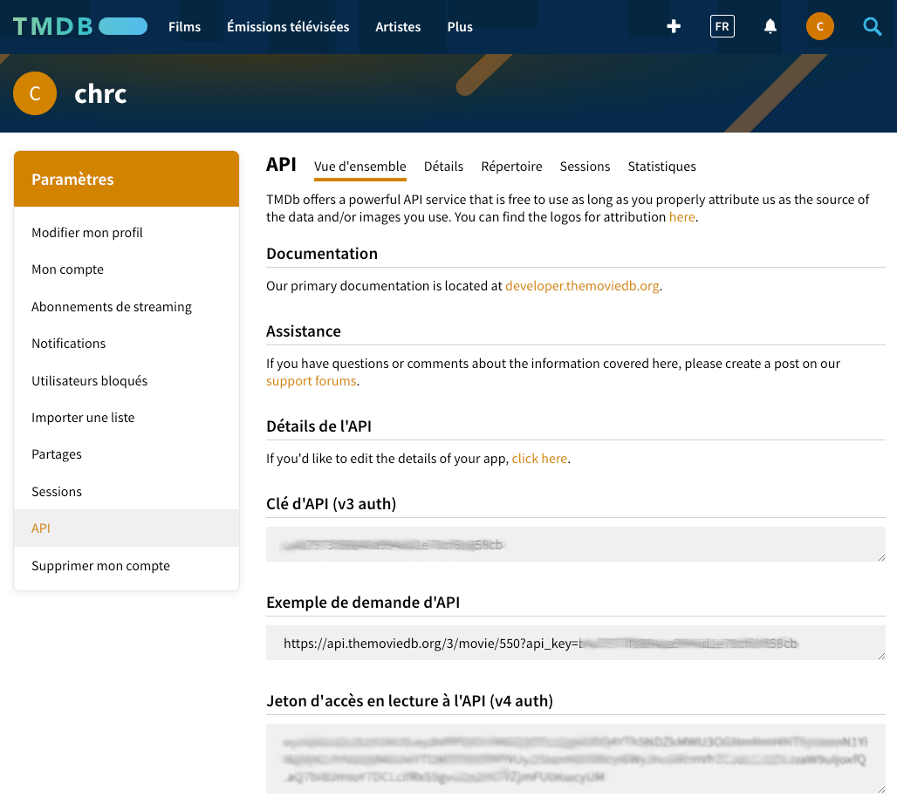
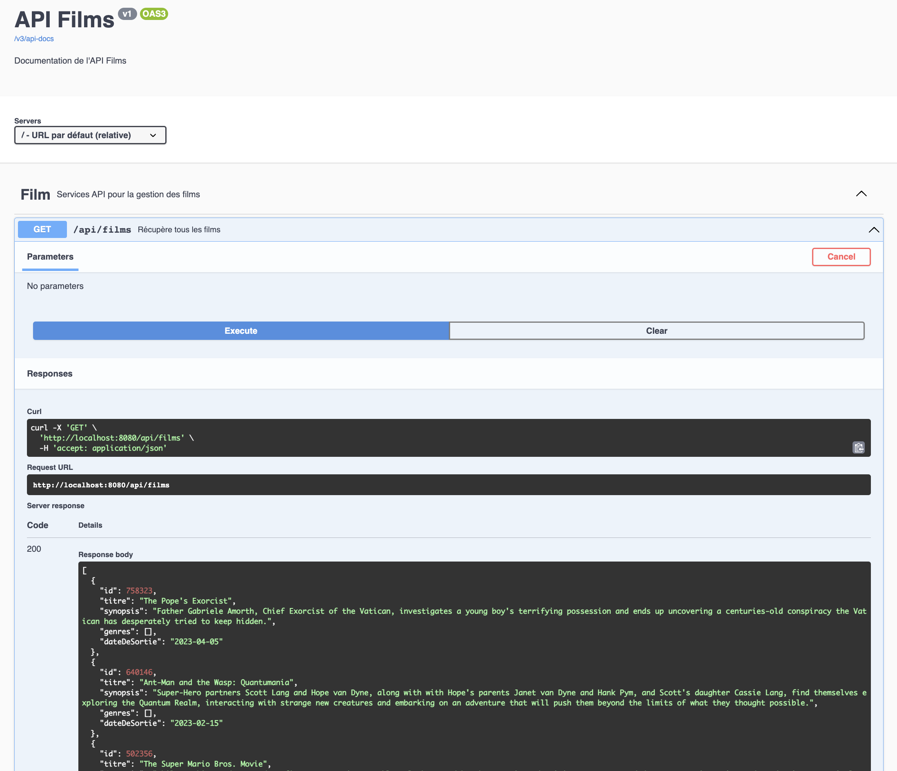

# ☕ AJAVA

> Ce repository contient le code source du TP sur le développement d'API en JAVA/Spring.

## 💻 Installation

Vous devez avoir sur votre poste :

* JAVA en version 17
* DOCKER (et docker-compose)

## 🚀 Démarrage

### Application Spring-Boot

Pour démarrer l'application, jouer la commande suivante :

* sur linux / macos :
    ```shell
    ./gradlew bootRun
    ```
* sur windows :
    ```shell
    ./gradlew.bat bootRun
    ```

L'application démarre sur le port par défaut de Spring-Boot, **8080**. <br>
Et swagger se trouve ici : http://localhost:8080/swagger-ui/index.html

### La base de données

Pour démarrer la BDD, il faut démarrer un container avec la commande :

``` shell
docker-compose up -d
```

La BDD démarre sur le port **15432**.

Les informations de la BDD comme le login, le password, le port, la bddname sont disponibles dans le
fichier `docker-compose.yml`

---

# TP 3 - Rechercher des Films TMDB

## Prerequis pour l'API TMDB

* Obtenir un compte pour utiliser l'API TMDB : [Page d'inscription](https://www.themoviedb.org/signup)
* Après l'inscription, votre Jeton d'accès en lecture à l'API va être généré : https://www.themoviedb.org/settings/api
  
* Créer un fichier `src/main/resources/.env`, avec le même contenu que le fichier `.env.exemple`
* Remplacer `<METTRE ICI LE JETON TMDB>` par votre **Jeton d'accès** à l'API TMDB

## Objectif

Exposer la liste des films provenant de l'API TMDB avec le paramètre recherché, sur la route `http://localhost:8080/api/films?query={query}`

* Ecrire le endpoint
  * Vous pouvez utiliser le `@RequestParam` pour récupérer le query param
* Ecrire un usecase `ChercherDesFilmsUseCase`, qui permet de rechercher par **nom de film** afin qu'il renvoie la liste des films recherchés depuis "TMDB"
* Utilisation d'une instance `TMDBHttpClient` pour appeler
  l'[API TMDB](https://developer.themoviedb.org/reference/search-movie)
  * Il existe déjà la fonction `chercherDesFilms` dans le client mais vous pouvez aller voir la doc
  * Il faut passer dans la query param `query` le nom de film que je veux rechercher par exemple
* Vous pourrez aussi avant de démarrer le swagger pour tester l'application corriger ou écrire les tests existants pour chaques classes

## Résultat avec Swagger-UI



---

<details>
  <summary>Documentations officielles Spring</summary>

### Documentations Spring

* [Official Gradle documentation](https://docs.gradle.org)
* [Spring Boot Gradle Plugin Reference Guide](https://docs.spring.io/spring-boot/docs/2.7.1/gradle-plugin/reference/html/)
* [Create an OCI image](https://docs.spring.io/spring-boot/docs/2.7.1/gradle-plugin/reference/html/#build-image)
* [Testcontainers Postgres Module Reference Guide](https://www.testcontainers.org/modules/databases/postgres/)
* [Spring Boot DevTools](https://docs.spring.io/spring-boot/docs/2.7.1/reference/htmlsingle/#using.devtools)
* [Spring Security](https://docs.spring.io/spring-boot/docs/2.7.1/reference/htmlsingle/#web.security)
* [Spring Web](https://docs.spring.io/spring-boot/docs/2.7.1/reference/htmlsingle/#web)
* [Testcontainers](https://www.testcontainers.org/)
* [Spring REST Docs](https://docs.spring.io/spring-restdocs/docs/current/reference/html5/)
* [Spring Data JPA](https://docs.spring.io/spring-boot/docs/2.7.1/reference/htmlsingle/#data.sql.jpa-and-spring-data)
* [Spring Boot Actuator](https://docs.spring.io/spring-boot/docs/2.7.1/reference/htmlsingle/#actuator)

### Guides

* [Securing a Web Application](https://spring.io/guides/gs/securing-web/)
* [Spring Boot and OAuth2](https://spring.io/guides/tutorials/spring-boot-oauth2/)
* [Authenticating a User with LDAP](https://spring.io/guides/gs/authenticating-ldap/)
* [Building a RESTful Web Service](https://spring.io/guides/gs/rest-service/)
* [Serving Web Content with Spring MVC](https://spring.io/guides/gs/serving-web-content/)
* [Building REST services with Spring](https://spring.io/guides/tutorials/rest/)
* [Accessing Data with JPA](https://spring.io/guides/gs/accessing-data-jpa/)
* [Building a RESTful Web Service with Spring Boot Actuator](https://spring.io/guides/gs/actuator-service/)

### Liens supplémentaires

* [Gradle Build Scans – insights for your project's build](https://scans.gradle.com#gradle)

</details>
