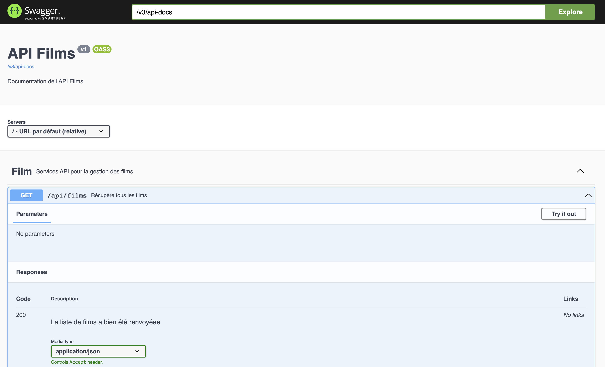

# ☕ AJAVA

> Ce repository contient le code source du TP sur le développement d'API en JAVA/Spring.

## 💻 Installation

Vous devez avoir sur votre poste :

* JAVA en version 21
* DOCKER (et docker-compose)

## 🚀 Démarrage

### Application Spring-Boot

Pour démarrer l'application, jouer la commande suivante :

* sur linux / macos :
    ```shell
    ./gradlew bootRun
    ```
* sur windows :
    ```shell
    ./gradlew.bat bootRun
    ```

L'application démarre sur le port par défaut de Spring-Boot, **8080**.

### La base de données

Pour démarrer la BDD, il faut démarrer un container avec la commande :

``` shell
docker-compose up -d
```

La BDD démarre sur le port **15432**.

Les informations de la BDD comme le login, le password, le port, la bddname sont disponibles dans le
fichier `docker-compose.yml`

### Accès à l'API avec Swagger-UI

Ouvrir la page `http://localhost:8080/swagger-ui/index.html`



## ✅ Tests

Pour lancer tous les tests :

* sur linux / macos
    ```shell
    ./gradlew test
    ```
* sur windows
    ```shell
    ./gradlew.bat test
    ```

---

# TP 5 bis - Modifier un film vu

## Objectif

Modifier un un film vu déjà existant en BDD, en modifiant la note et le commentaire (par le même utilisateur).

* Compléter le controller `FilmVuController`
    * Utilisation de l'`int` `filmId` avec l'annotation `@PathVariable`
    * Utilisation de la classe `CritiqueApi` en paramètre de la fonction du endpoint pour récupérer le body de la request avec l'annotation `@RequestBody`
    * Utilisation de la classe `Authentication` en paramètre de la fonction du endpoint pour récupérer l'information de l'utilisateur connecté
* Compléter le use case `ModifierUnFilmVuUseCase`
    * En utilisant le `FilmVuRepository`
        * Vérifier que le film vu existe bien, sinon renvoyer `null`
        * Modifier le film vu avec la nouvelle note et le nouveau commentaire, et le renvoyer
* Compléter le test `DatabaseFilmVuRepositoryFTest`
* Compléter le test `ModifierUnFilmVuUseCaseTest`
* Compléter le test `FilmVuControllerFTest`


* Vous pourrez aussi, avant de démarrer le swagger pour tester l'application, corriger ou écrire les tests existants pour chaque classes.

---

<details>
  <summary>Documentations officielles</summary>

### Documentations Spring

* [Official Gradle documentation](https://docs.gradle.org)
* [Spring Boot Gradle Plugin Reference Guide](https://docs.spring.io/spring-boot/docs/2.7.1/gradle-plugin/reference/html/)
* [Create an OCI image](https://docs.spring.io/spring-boot/docs/2.7.1/gradle-plugin/reference/html/#build-image)
* [Testcontainers Postgres Module Reference Guide](https://www.testcontainers.org/modules/databases/postgres/)
* [Spring Boot DevTools](https://docs.spring.io/spring-boot/docs/2.7.1/reference/htmlsingle/#using.devtools)
* [Spring Security](https://docs.spring.io/spring-boot/docs/2.7.1/reference/htmlsingle/#web.security)
* [Spring Web](https://docs.spring.io/spring-boot/docs/2.7.1/reference/htmlsingle/#web)
* [Testcontainers](https://www.testcontainers.org/)
* [Spring REST Docs](https://docs.spring.io/spring-restdocs/docs/current/reference/html5/)
* [Spring Data JPA](https://docs.spring.io/spring-boot/docs/2.7.1/reference/htmlsingle/#data.sql.jpa-and-spring-data)
* [Spring Boot Actuator](https://docs.spring.io/spring-boot/docs/2.7.1/reference/htmlsingle/#actuator)

### Guides

* [Securing a Web Application](https://spring.io/guides/gs/securing-web/)
* [Spring Boot and OAuth2](https://spring.io/guides/tutorials/spring-boot-oauth2/)
* [Authenticating a User with LDAP](https://spring.io/guides/gs/authenticating-ldap/)
* [Building a RESTful Web Service](https://spring.io/guides/gs/rest-service/)
* [Serving Web Content with Spring MVC](https://spring.io/guides/gs/serving-web-content/)
* [Building REST services with Spring](https://spring.io/guides/tutorials/rest/)
* [Accessing Data with JPA](https://spring.io/guides/gs/accessing-data-jpa/)
* [Building a RESTful Web Service with Spring Boot Actuator](https://spring.io/guides/gs/actuator-service/)

### Liens supplémentaires

* [Gradle Build Scans – insights for your project's build](https://scans.gradle.com#gradle)

</details>
